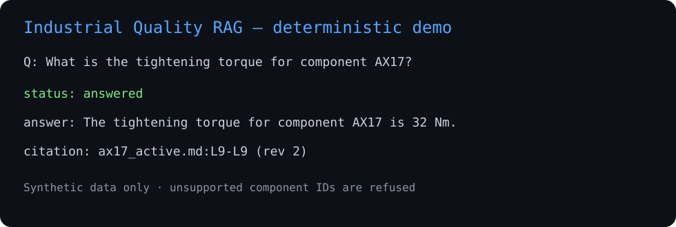

# Industrial Quality Documentation Assistant

> **Repository identity:** the GitHub slug `hermes` is historical. This repository contains the **Industrial Quality Documentation Assistant** portfolio project. It is separate from Michał Dembski's private agent-orchestration R&D work.

[](https://github.com/lemoniadowyjohn/hermes/actions/workflows/ci.yml)

A compact, evidence-grounded RAG-style system for **synthetic** industrial quality documentation. The project focuses on retrieval controls, provenance, revision handling, refusal/escalation behavior and testability rather than on claiming production-scale GenAI infrastructure.



## Problem

Industrial quality questions often depend on the correct component, active document revision and traceable evidence. A plausible answer is not enough if the system cannot show where it came from or detect when the requested evidence is missing or stale.

## Solution

```text
Synthetic Markdown documents
        |
line-aware parsing + metadata
        |
active-revision/status filtering
        |
embedding provider
  |                     |
deterministic hash      optional OpenAI embeddings
(CI baseline)           (integration path)
        |
in-memory cosine retrieval
        |
answer provider
  |                     |
deterministic evidence  optional OpenAI Responses
extractor (CI)          (integration path)
        |
refusal / conflict / provenance gates
        |
FastAPI response with status + citations + reasons
```

## Technology

- Python 3.11+
- FastAPI + Pydantic
- deterministic hash embeddings for offline regression tests
- optional OpenAI embeddings and Responses provider
- pytest
- Docker
- GitHub Actions

## Recruiter quick view

The repository demonstrates:

- synthetic document ingestion with revision/status metadata;
- active-revision selection before retrieval;
- component-aware retrieval;
- evidence citations with file and line provenance;
- refusal of unknown component identifiers;
- exclusion of superseded requirements;
- conservative conflict/escalation logic;
- provider interfaces that keep CI independent of paid API access;
- containerized API execution verified in CI.

## Run locally

```bash
python -m venv .venv
source .venv/bin/activate  # Windows: .venv\Scripts\activate
pip install -e ".[dev]"
pytest -q
python scripts/evaluate.py
uvicorn iqda.api:app --host 0.0.0.0 --port 8000
```

Health check:

```bash
curl http://127.0.0.1:8000/health
```

## Optional live-provider mode

Install the optional provider dependency and supply configuration at runtime:

```bash
pip install -e ".[llm]"
export IQDA_MODE=openai
export OPENAI_API_KEY=...
export IQDA_MODEL=gpt-5-mini
export IQDA_EMBEDDING_MODEL=text-embedding-3-small
```

The public CI acceptance gate intentionally uses deterministic providers. Therefore this repository proves the **workflow and control implementation**, not general-world LLM accuracy or real-provider performance.

## Tests and evaluation

GitHub Actions runs:

1. package installation;
2. pytest regression tests;
3. `scripts/evaluate.py` against the bundled synthetic corpus;
4. Docker image build;
5. container startup and `/health` smoke test.

See [EVALUATION.md](EVALUATION.md) for the bounded evaluation scope.

## Repository layout

```text
src/iqda/                  application code
tests/                     regression tests
data/synthetic_docs/       synthetic quality documents
scripts/evaluate.py        bounded regression evaluation
docs/demo.svg              recruiter-facing demo visual
ARCHITECTURE.md             architecture notes
EVALUATION.md               evaluation scope
LIMITATIONS.md              known limitations
SECURITY_AND_PRIVACY.md     data/privacy boundary
Dockerfile                  container packaging
.github/workflows/ci.yml    automated verification
```

## Limitations

This is a portfolio implementation, not a production document-control system. The corpus is deliberately small, the offline embedding baseline is not a semantic production model, and the API does not include enterprise authentication or authorization.

See [LIMITATIONS.md](LIMITATIONS.md).

## Data and claim boundary

- all bundled documents are synthetic;
- no employer/customer documents or proprietary records are included;
- credentials are never committed;
- this project is portfolio/project evidence, not a claim of professional production RAG deployment;
- the optional OpenAI path is an integration path, not a published accuracy benchmark.

## Related portfolio

- [Governed Agent Workflow Demo](https://github.com/lemoniadowyjohn/space-Y-) — policy-aware routing, fallback and approval-boundary demonstration.
- [CARLA Map Quality Toolkit](https://github.com/lemoniadowyjohn/carla-control-suite/tree/portfolio/carla-map-quality-toolkit-20260930/portfolio/carla-map-quality-toolkit) — automotive/geospatial validation toolkit.
- [Python Excel Data Reconciliation Demo](https://github.com/lemoniadowyjohn/space-Y--/tree/master/portfolio/python-excel-data-reconciliation-demo) — deterministic spreadsheet reconciliation.
- [Power Platform Quality App](https://github.com/lemoniadowyjohn/watson/tree/main/portfolio/power-platform-quality-app) — documented Power Platform quality-workflow reference design.
